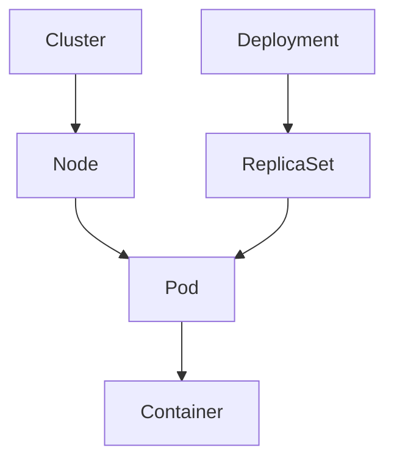

# Kubernetes Fundamentals

## What Kubernetes Does

Kubernetes is an orchestration platform for running containerized applications at scale.
It schedules workloads, manages Pods, and keeps applications running even when failures happen.

Kubernetes is built to support:
- scaling applications up and down
- distributing requests across replicas
- replacing failed Pods automatically
- rolling updates with minimal downtime
- service discovery through stable names
- multi-node scheduling

## Cluster vs Node vs Pod vs Container

### Cluster
A cluster is a group of machines that work together to run Kubernetes workloads.
A cluster includes a control plane and one or more nodes.

### Control plane
The control plane manages the cluster state and includes components such as:
- `kube-apiserver`
- `etcd`
- `kube-scheduler`
- `kube-controller-manager`

### Worker node
A worker node runs application Pods.
It has components like `kubelet`, `kube-proxy`, and a container runtime.

### Pod
A Pod is the smallest deployable unit.
It can contain one or more containers that share network and storage.

### Container
A container runs application code inside a Pod.
The node's container runtime pulls the image and starts the container.

## Resource hierarchy



## Namespaces

Namespaces partition cluster resources into multiple virtual clusters.
They help organize workloads and reduce naming collisions.

Examples:
- `default` for user workloads created without a namespace
- `kube-system` for core Kubernetes infrastructure
- `kube-public` for public cluster information
- `local-path-storage` for development storage resources

Namespaces are similar to:
- Oracle schemas
- Java packages
- Linux folders

Namespaces are useful for organization, but not full security boundaries.

## Deployment, ReplicaSet, and Service

### Deployment
A Deployment is a declarative object that manages ReplicaSets.
It defines the desired state for a set of Pods and handles updates.

### ReplicaSet
A ReplicaSet ensures a specific number of Pod replicas are running.
It is usually managed by a Deployment rather than created directly.

### Service
A Service provides stable networking for Pods.
It routes traffic to matching Pods using label selectors.

## Control-plane components

### kube-apiserver
The API Server exposes the Kubernetes API.
All `kubectl` commands and internal components communicate through it.

### etcd
A distributed key-value store that stores cluster state and configuration.
It is the source of truth for Kubernetes desired state.

### kube-scheduler
Assigns Pods to suitable nodes based on resources and policies.
It watches for new Pods that need scheduling.

### kube-controller-manager
Runs controllers such as:
- Node controller
- Replication controller
- Deployment controller
- Endpoint controller

Controllers reconcile desired state with actual state.

## Node components

### kubelet
The kubelet runs on every node and ensures Pods are healthy.
It talks to the container runtime and the API Server.

### kube-proxy
kube-proxy configures networking rules so Services can reach Pods.
It applies IP table or IPVS rules depending on implementation.

### Container runtime
A runtime like `containerd` pulls images and starts containers.
Kubernetes delegates container creation to this runtime.

### CNI plugin
A Container Network Interface plugin provides Pod networking.
In local clusters, plugins such as `kindnet` or `Flannel` may be used.

## Supporting infrastructure

### CoreDNS
A DNS server for Kubernetes Service discovery.
It resolves Service names such as `http://pricing-service`.

### local-path-provisioner
A local storage provisioner used in development clusters.
It creates persistent volumes backed by local disk.

### kindnet
A networking plugin used by kind clusters.
It connects Pod networks inside the Docker-based cluster.

## Declarative management

Kubernetes uses declarative configuration.
Users declare the desired state, and controllers work to make the actual state match.

This means:
- you do not tell Kubernetes every step to perform
- you declare the target state instead
- Kubernetes automatically reconciles drift

## Why Kubernetes is not a replacement for Docker

Docker builds images and runs containers.
Kubernetes orchestrates container deployments across nodes.

For example:
- Docker packages a Spring Boot microservice image.
- Kubernetes schedules the microservice on a node and maintains availability.

## Production examples

A commerce application may use:
- `app=checkout`
- `environment=production`
- `team=ecommerce`
- `version=v1`

A Service could route traffic from `checkout` to `pricing` and `catalog` Pods.
A Deployment could manage multiple `payment` Pods behind a load-balanced Service.

## Observed local cluster architecture

```text
Windows
└── WSL2
    └── Docker Desktop
        └── kind cluster
            └── desktop-control-plane node
                └── Pod: nginx
```